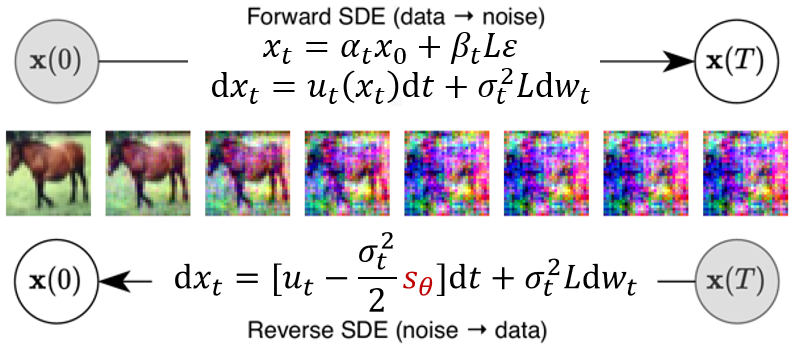
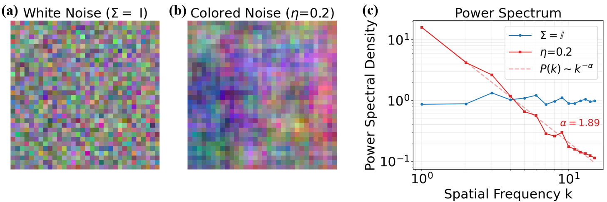
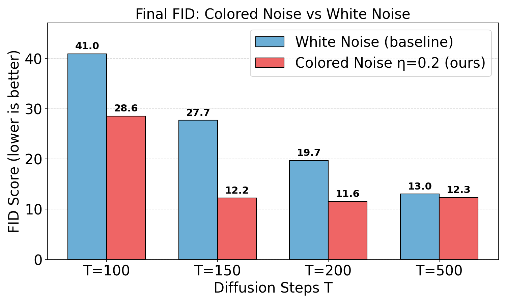
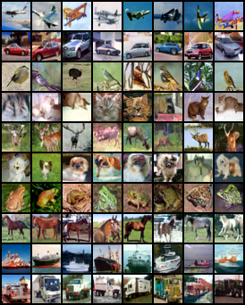
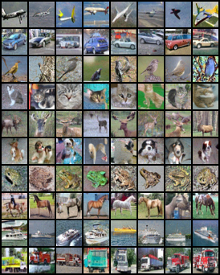
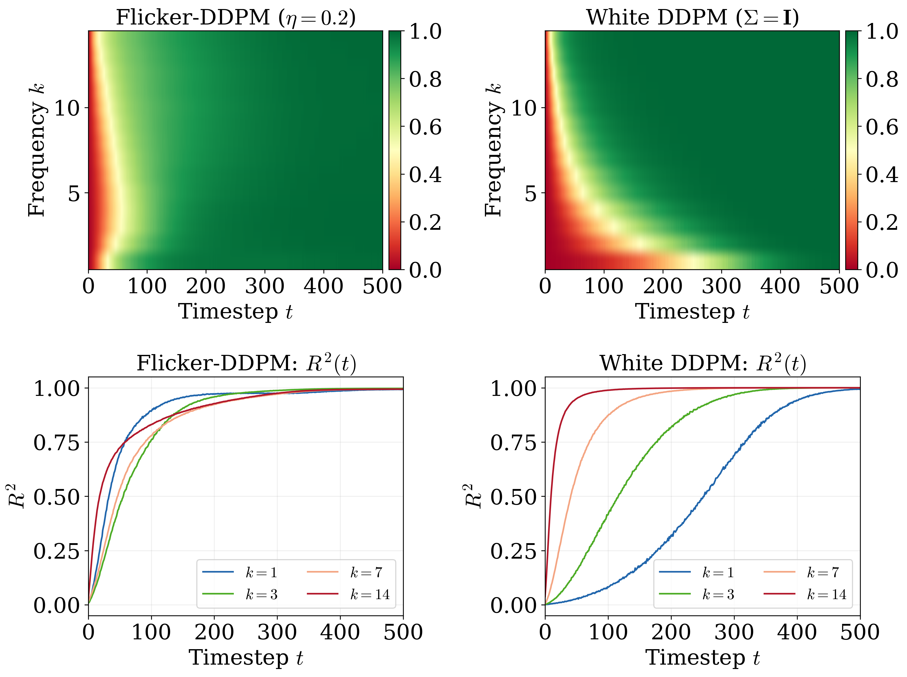
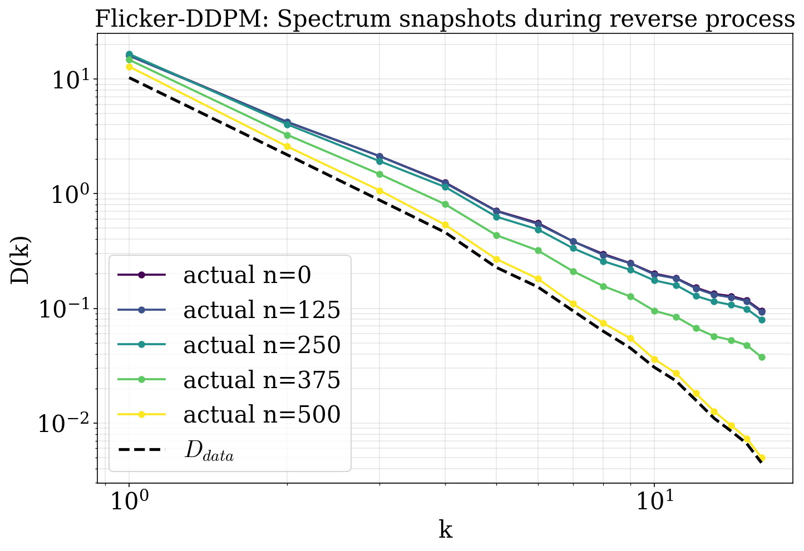
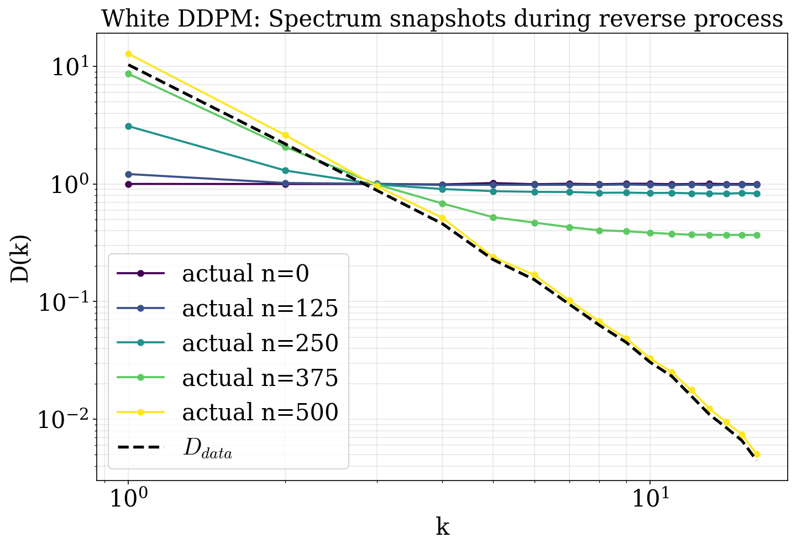

# Flicker-DDPM: Accelerating Denoising Diffusion via 1/f Colored Noise Injection

[](https://arxiv.org/abs/2606.03393)

> **Flicker-DDPM** incorporates flicker (1/f) noise inspired by self-organized criticality into denoising diffusion probabilistic models, achieving **3.33× sampling acceleration** with simultaneous quality improvement on CIFAR-10.

<p align="center">
  
</p>

## Key Idea

Standard DDPMs corrupt data into **white noise** (flat spectrum), but natural images have power-law spectra P(k) ∝ k<sup>−α</sup> with α ≈ 2.7. This spectral mismatch forces the reverse process to waste hundreds of steps reshaping the frequency structure before generating content.

**Flicker-DDPM** replaces white noise with spectrally colored noise whose power spectrum matches the data. The noise is generated via a simple spatial correlation kernel:

$$C(d) = (d + 1)^{-\eta}$$

where η is analytically determined from data statistics through Matérn covariance theory:

$$\eta = \frac{3 - \alpha}{2}$$

For CIFAR-10: α = 2.70 → η<sub>opt</sub> = 0.20. **No hyperparameter search required.**

<p align="center">
  
</p>
<p align="center"><em>White noise (flat spectrum) vs. colored noise (power-law spectrum matching natural images).</em></p>

## Results

### 3.33× Faster Sampling with Better Quality

| T (steps) | White DDPM (FID↓) | Flicker-DDPM (FID↓) | Improvement |
|:---:|:---:|:---:|:---:|
| 100 | 36.17 | 22.57 | −37.6% |
| 150 | 25.36 | **12.24** | −51.7% |
| 200 | 18.08 | **11.57** | −36.0% |
| 500 | 13.02 | 11.96 | −8.1% |

FID is computed using 10,000 generated samples against the CIFAR-10 training set. Flicker-DDPM at T=150 outperforms standard DDPM at T=500 (FID 12.24 vs 13.02), yielding a **500/150 ≈ 3.33× speedup**.

<p align="center">
  
</p>
<p align="center"><em>FID scores across diffusion steps. Flicker-DDPM consistently outperforms the white-noise baseline.</em></p>

### Sample Comparison (T=150)

<p align="center">
  
  
</p>
<p align="center"><em>Left: Flicker-DDPM (η=0.2). Right: white-noise DDPM. At the same step budget, Flicker-DDPM produces sharper, more coherent images.</em></p>

## Why It Works: Linearization of Reverse Dynamics

Colored noise **linearizes** the reverse diffusion trajectory in Fourier space. When noise already carries the correct spectral structure (L(k) = 0), the denoiser operates in a near-linear regime at all frequencies — eliminating the nonlinear spectral reshaping bottleneck.

<p align="center">
  
</p>
<p align="center"><em>Linearization quality R²(k,t). Flicker-DDPM achieves R² > 0.95 uniformly across all modes, while white DDPM shows extreme disparity (R² = 0.505 at k=1 vs 0.968 at k=14).</em></p>

<p align="center">
  
</p>
<p align="center"><em>Spectral evolution during reverse sampling (Flicker-DDPM): all frequency modes converge to the target in concert.</em></p>

<p align="center">
  
</p>
<p align="center"><em>Spectral evolution (white DDPM): spectrum starts flat and must be rebuilt sequentially, requiring ~350 extra steps.</em></p>

## Project Structure

```
├── main.py              # CLI entry point (train / sample / FID eval)
├── models/              # Network architectures
│   ├── unet.py          # Unconditional UNet
│   └── unet_cfg.py      # Classifier-free guidance UNet
├── core/                # Core components
│   ├── diffusion.py     # DiffusionTrainer & DiffusionSampler
│   ├── noise.py         # NoiseModule (white / colored via Cholesky or FFT)
│   ├── train.py         # Training & sampling loops
│   ├── eval_fid.py      # FID evaluation pipeline
│   ├── scheduler.py     # Learning rate warmup scheduler
│   └── visualizer.py    # Training diagnostics & visualization
├── analysis/            # Theory verification & spectral analysis
│   ├── gamma_ode.py     # Measure γ(k,t) and validate linear-theory ODE
│   ├── fit_eta.py       # Fit power-law exponent from CIFAR-10 spectrum
│   └── verify_matern.py # Matérn kernel theory verification
├── scripts/             # Plotting scripts
└── figures/             # Paper figures
```

## Requirements

```
torch >= 2.0
torchvision
numpy
scipy
matplotlib
tqdm
pytorch-fid
```

## Usage

### Training

```bash
# White noise baseline, T=500
python main.py --noise_type white --T 500 --epoch 200

# Colored noise (η=0.2), T=150
python main.py --noise_type colored --eta 0.2 --T 150 --epoch 200

# Multi-GPU (DDP)
torchrun --nproc_per_node=4 main.py --noise_type colored --eta 0.2 --T 150
```

### Sampling

```bash
python main.py --eval --noise_type colored --eta 0.2 --T 150 --ckpt ckpt_199_.pt
```

### FID Evaluation

```bash
python main.py --fid --noise_type colored --eta 0.2 --T 150
```

### Analysis

```bash
# Measure γ(k,t) and validate ODE predictions
python analysis/gamma_ode.py --noise_type colored --eta 0.2 --T 500

# Fit power-law exponent α from CIFAR-10
python analysis/fit_eta.py
```

## Citation

```bibtex
@article{mao2026flicker,
  title={Flicker-DDPM: Accelerating Denoising Diffusion via 1/f Colored Noise Injection},
  author={Mao, Kexiang},
  journal={arXiv preprint arXiv:2606.03393},
  year={2026}
}
```

## License

MIT
